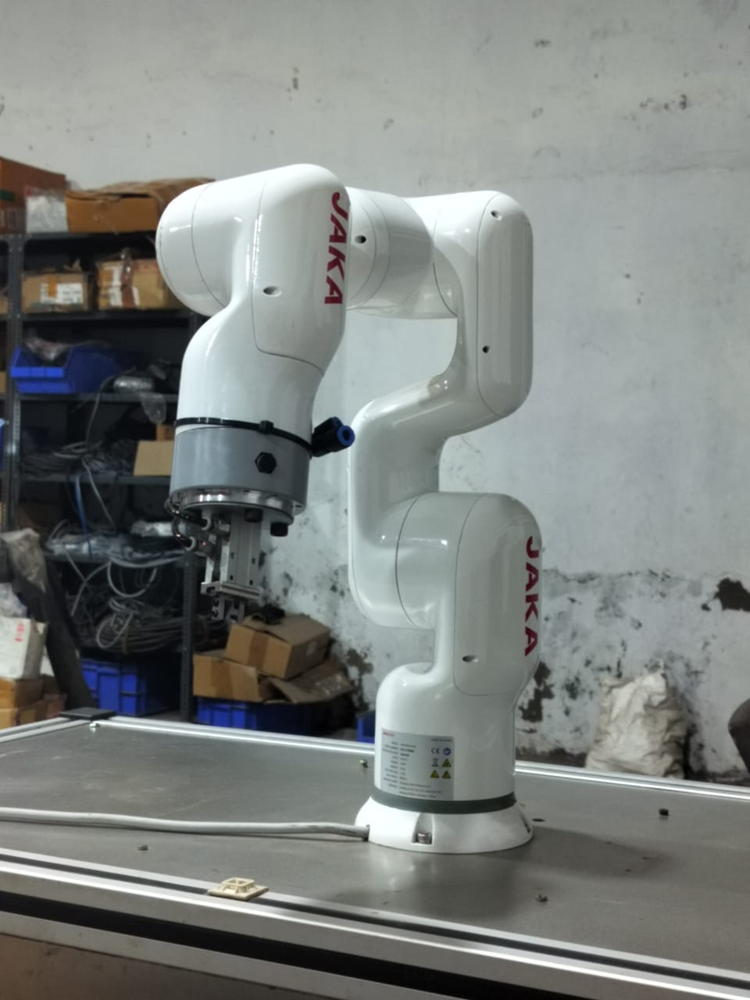
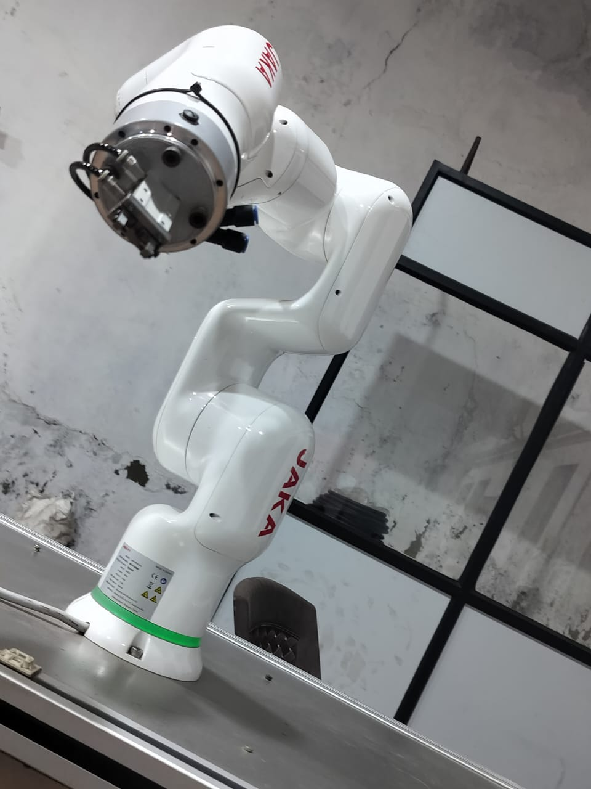
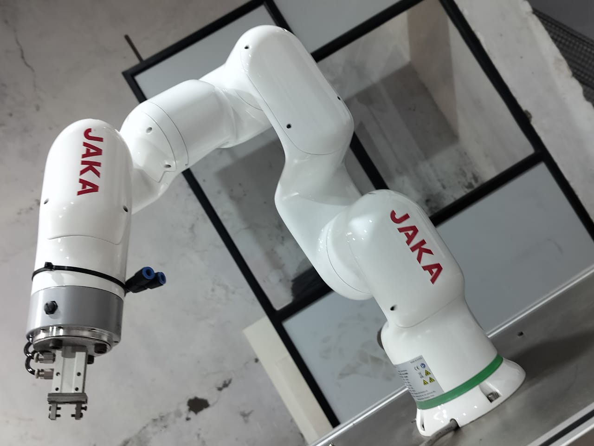
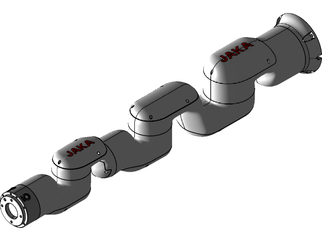
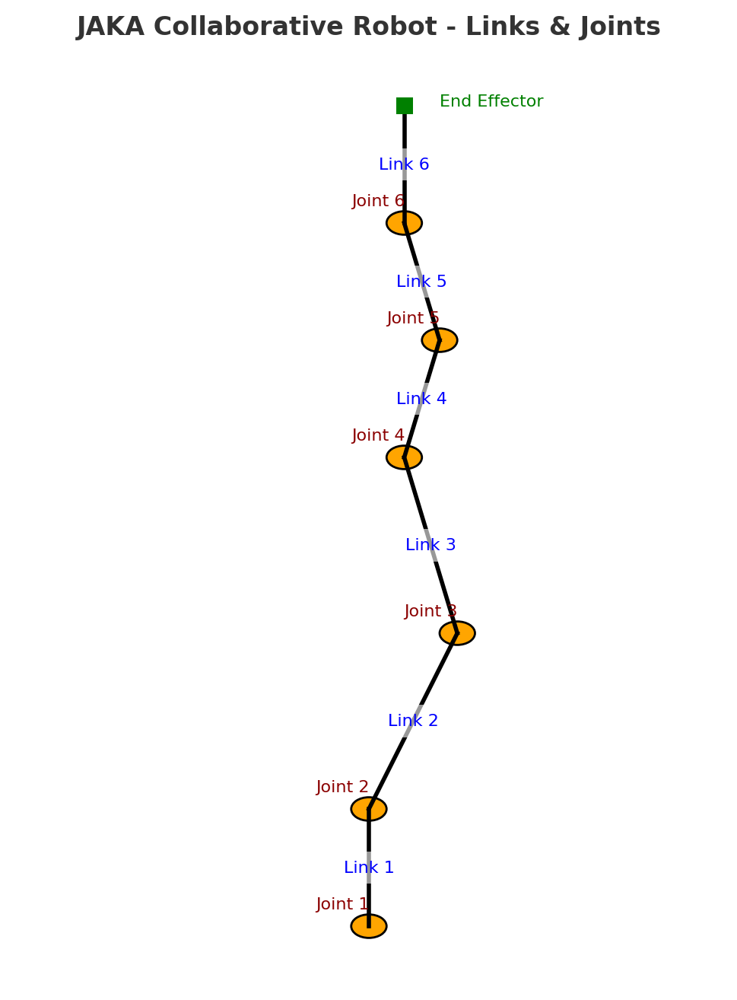
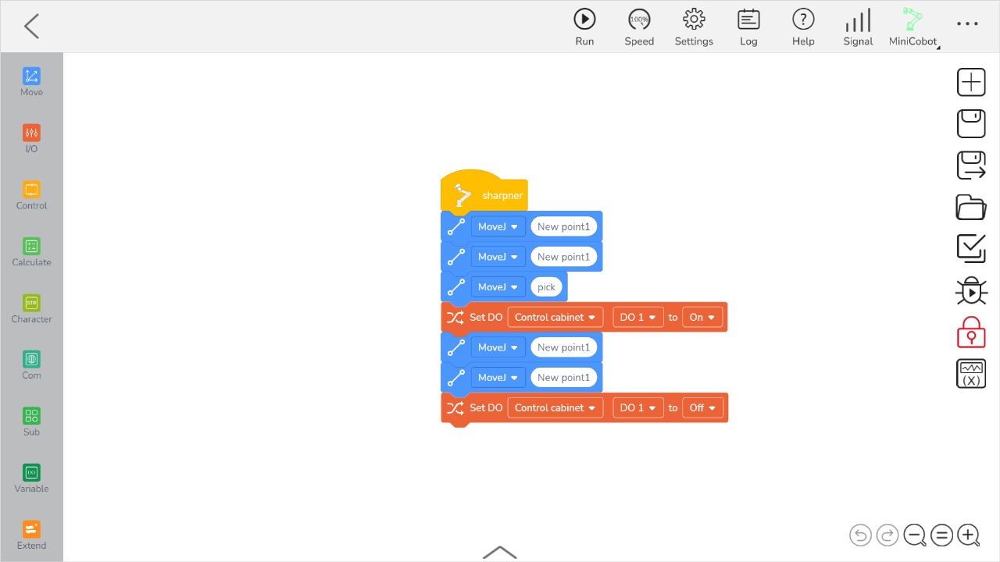

# 🤖 JAKA Collaborative Robot – Project Portfolio

Welcome to my **JAKA Cobot Project Portfolio**, where I combined everything I have learned and implemented with the **JAKA Collaborative Robot (6-DOF serial manipulator)**.

This repo is designed as both a **showcase for my work** and a **practical guide** for anyone who wants to understand and replicate these projects.

---

## 🏗 About JAKA Collaborative Robot

**JAKA (Just Always Keep Amazing)** cobots are **6-axis collaborative robots** widely used in industrial automation, assembly, and research.
They are safe to work around humans, easy to program, and flexible for multiple tasks.

### 🔑 Key Features:

* ✅ **6 DOF (Degrees of Freedom)** – similar to a human arm
* ✅ **High repeatability & accuracy**
* ✅ **Supports multiple motion types** – Joint, Linear, Circular
* ✅ **Easy integration with grippers, vision, and PLCs**
* ✅ **Safe for collaborative environments**

📸 Example photos of JAKA cobot in use:

  
  


---

## 🖥 JAKA Software Interface (UI)

The JAKA software provides two main modes:

- **Manual Operation** → Move the cobot joints or end-effector manually.  
- **Programming** → Create sequences of movements using block-based commands.  

### Manual Operation Mode


In this mode, you can directly move the cobot in **X, Y, Z translation** and **RX, RY, RZ rotation**, or by controlling individual joints.

### Programming Mode


Movements can be created with drag-and-drop blocks like **MoveJ**, **MoveL**, and **Wait**, allowing quick task creation.

---

## 🧩 CAD Model of JAKA

To better understand the cobot’s structure and mechanics, I worked with its **CAD representation**:



---

## 1️⃣ Robot Mechanics Demonstration

This project connects **theory (mechanics)** with **real-world robotics** using JAKA.

### 🎯 Objectives

* Identify **links and joints** of a cobot  
* Understand **6 DOF** configuration  
* Visualize the mechanical motion  

### 🛠 Technical Explanation

* **Links**: 7 (including base as Link 0, and tool mounting as Link 7)  
* **Joints**: 6, all **rotary/revolute**  
* **Configuration**: 6-DOF serial manipulator  

📸 Diagram of links and joints:  


---

## 2️⃣ Motion Commands – MoveJ, MoveL, MoveC

Robotic motion is the **heart of cobot programming**.  
Here are the three main commands:

### 🔹 MoveJ – Joint Movement

* Moves each joint to target angles (fastest).  
* Path of tool (TCP) is not straight.  
* ✅ Best for **approach, retract, repositioning**.  

  
▶️ [Watch MoveJ Demo](https://drive.google.com/file/d/1vsO3cmxGxyEdyfHisvhAHMG34MEnLgcH/view?usp=sharing)

---

### 🔹 MoveL – Linear Movement

* TCP moves in a **straight line** in Cartesian space.  
* Slower than MoveJ, but very precise.  
* ✅ Best for **pick & place, assembly, welding**.  

  
▶️ [Watch MoveL Demo](https://drive.google.com/file/d/1LKv0oqTbGd1cUirSIOzAP2ixPQIm_Wuy/view?usp=sharing)

---

### 🔹 MoveC – Circular Movement

* TCP follows a **circular arc** defined by two points.  
* ✅ Best for **arc welding, polishing**.  

 
---

### 🔎 Comparison Table

| Command   | Path Type              | Speed   | Accuracy       | Use Cases                     |
| --------- | ---------------------- | ------- | -------------- | ----------------------------- |
| **MoveJ** | Joint interpolation    | Fastest | Not linear     | Approach, retract, reposition |
| **MoveL** | Linear interpolation   | Medium  | Precise linear | Pick & place, assembly        |
| **MoveC** | Circular interpolation | Medium  | Arc-precise    | Polishing, arc welding        |

---

## 3️⃣ Pick and Place – Sharpener Project

This is an **industrial pick & place task** performed with a **pneumatic gripper**.

### 🛠 Hardware Setup

* JAKA Collaborative Robot  
* Pneumatic Gripper + Air Compressor  
* Sharpener (target object)  
* Fixtures & Work Table  

📸 Setup photo:  


---

### ⚙️ Program Flow

1. **Home Position** → Safe start  
2. **Approach Position** → Move above pick object  
3. **Pick** → Gripper closes (DO = On)  
4. **Transfer Path** → MoveJ to place location  
5. **Place** → Gripper opens (DO = Off)  
6. **Retract** → Return to Home  

📸 Program Flow Diagram:  


---

### 📝 Example Code (Pseudo-JAKA Script)

```python
MoveJ(home)
MoveJ(pre_pick)
MoveJ(pick)
SetDO(1, ON)   # Gripper close
MoveJ(retract)
MoveJ(pre_place)
MoveJ(place)
SetDO(1, OFF)  # Gripper open
MoveJ(home)
````

📽 Demo:
▶️ [Watch Pick and Place Demo](https://drive.google.com/file/d/1_QK3mkfCwfpWjCR7SRSeIoO2WEfEr6dQ/view?usp=sharing)

---

## 🦺 Safety Guidelines

* Always start with **low speed mode**
* Use **waypoints** to avoid collisions
* Adjust pneumatic pressure to prevent damage
* Keep safe zones around workspace

---

## 👩‍💻 Author

**Khushi Singh**
Project developed during Internship @ **Acrobot Technologies Pvt. Ltd.**


