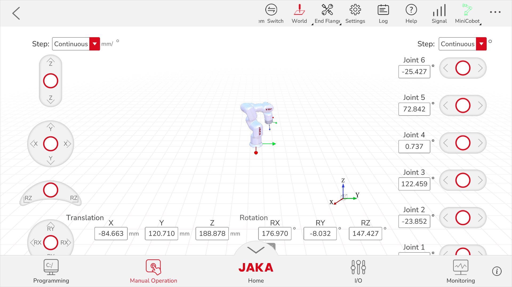
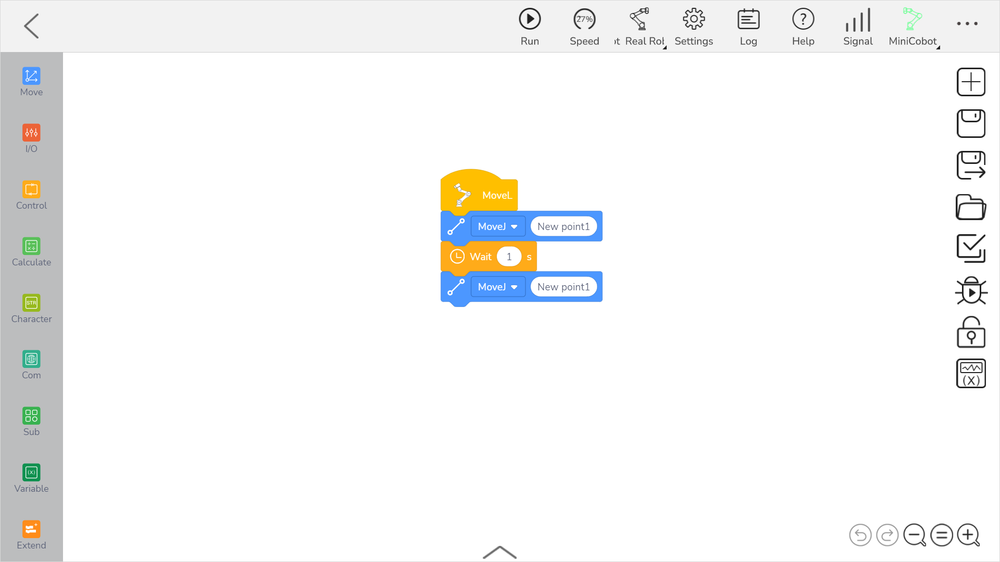

# 🤖 JAKA Collaborative Robot – Technical Project Portfolio

Welcome to my **JAKA Collaborative Robot Project Portfolio**, a comprehensive compilation featuring theoretical models, code implementations, and real-world integration using a **JAKA 6-DOF collaborative robotic manipulator**.

---

## 🏗 System Overview & Capabilities

**JAKA cobots** are 6-axis robots with full collaborative features, known for their **open architecture**, **versatile programming interfaces**, and **high precision**.  
Key attributes include:

- **6 revolute joints** (serial, anthropomorphic configuration)
- **Payload:** 3–12 kg (model-dependent)
- **Repeatability:** ±0.02 mm
- **Interface:** JAKA App UI, Python/C++ SDK, ROS, PLC/Modbus TCP support
- **End-effector:** ISO 9409-1-50-4-M6 tool flange for grippers, vision, and sensors

### Example Images

  
  
  

---

## 🖥 Software & User Interface

- **Manual Jog Mode:** For direct joint/Cartesian motion, TCP offset setup, and teaching.
- **Programming Mode:** Block-based programming (`MoveJ`, `MoveL`, `MoveC`, `Wait`, `SetDO`), plus advanced scripting and logic.

### UI Example (Manual)

### UI Example (Programming)

---

## 🧩 Robot Structure & CAD Modeling

All link configurations are referenced to the **DH convention** for kinematic calculations.
- **6 rotary axes** with offset parameters and reference frames.
- For robot simulation, the CAD is integrated with kinematic libraries & tested for physical constraints.

---

## 1️⃣ Kinematic Modeling & Calibration

### Denavit–Hartenberg (DH) Table

| Joint (i) | θ_i | d_i [mm] | a_i [mm] | α_i [deg] | Offset |
|-----------|:---:|:--------:|:--------:|:---------:|--------|
| 1         | θ₁  | d₁       | a₁       | α₁        | Yes    |
| 2         | θ₂  | d₂       | a₂       | α₂        | Yes    |
| ...       | ... | ...      | ...      | ...       | ...    |
| 6         | θ₆  | d₆       | a₆       | α₆        | Yes    |

#### Homogeneous Transformation

Each link-to-link transform is:

Where **offset points** are applied as an additional transformation after the final (6th) joint for correctly positioning the Tool Center Point (TCP) with respect to the end flange.

#### TCP & Offset Points

- The **TCP offset** is stored as a 4×4 transformation matrix or a 6D vector (X, Y, Z, Rx, Ry, Rz), crucial if your end-effector is not mounted directly at the default tool flange.
- Offsets can be configured in the JAKA UI under **Tool Frame** setup.

Example (Python):

---

## 2️⃣ Motion Planning – Code & Demonstrations

### MoveJ, MoveL, MoveC Examples

**MoveJ (Joint space interpolation)**  
  

**MoveL (Linear Cartesian)**  
  

**MoveC (Circular Interpolation)**  
Best for path following, arc or circle tasks.

---

## 3️⃣ Industrial Pick & Place: Sharpener Project

### System Diagram + Setup

### Program Flow (Pseudo-code)

**Video:**  

### Offset Point Example

If your gripper/tcp is offset, all pick and place points are re-calculated:

---

## 🚀 Integration: ROS & External Control

**JAKA SDK** provides Python/C++ API for *real-time control, monitoring, and data exchange*.  
Advanced users can set up **ROS drivers** (`ros_jaka_driver`) for:

- Real-time joint state feedback
- Action servers for MoveJ/MoveL goals
- Integration with MoveIt! for complex path planning and collision avoidance

Example (Python, using JAKA SDK):

---

## 🦺 Safety & Best Practices

- Enable **reduced mode** when teaching paths
- Use **virtual fences** and **workspace monitoring**
- Always test offset and TCP calibration before executing automated sequences

---

## 👩‍💻 Author & Acknowledgements

**Khushi Singh** – Internship @ Acrobot Technologies Pvt. Ltd.  
Special thanks to the Acrobot robotics team for technical mentorship.

